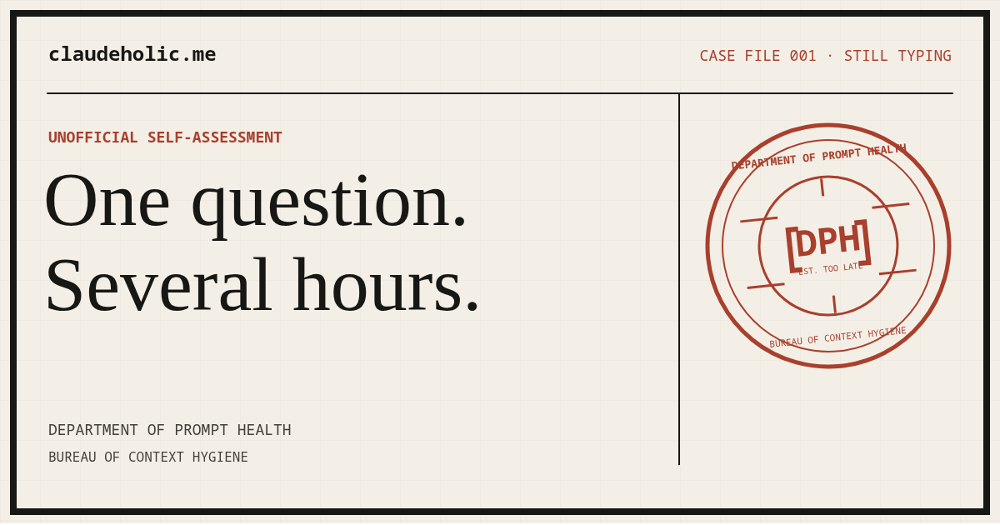

<p align="center">
  
</p>

# claudeholic.me

> I only opened Claude to ask one question.

[claudeholic.me](https://claudeholic.me/) is an unofficial dependency check for
people whose harmless prompt became an evening. It is a parody, a love letter,
a cautionary tale, and a practical guide to using generative AI with more
intention.

The joke is on us. The assessment is not medical. The advice about privacy,
verification, learning, breaks, hobbies, and asking humans is entirely sincere.

## Department tour

- **Dependency check:** Twelve increasingly specific symptoms, scored locally.
- **Stages:** A fictional progression from healthy curiosity to recreational
  release-note reading.
- **Recovery program:** Seven small ways to restore human agency without
  deleting every useful tool.
- **Context hygiene inspection:** A local prompt checker that flags secrets,
  excess context, and missing stopping conditions. Nothing leaves the desk.
- **Balance manifesto:** A sincere case for craft, skepticism, and learning by
  doing.
- **Department Bulletins:** Occasional practical notices with an RSS feed and
  no obligation to feed a content calendar.
- **Approved field notes:** A static, privacy-constrained ledger of recognizable
  tool-use patterns and practical counterparts.
- **Department records:** Local achievements, fictional institutions, and more
  paperwork than the premise strictly requires.
- **Restricted terminal:** There is no restricted terminal.

## Static by choice

The production site is semantic HTML, modern CSS, and native JavaScript modules.
It has:

- zero runtime dependencies;
- no framework or build step;
- no analytics, cookies, accounts, or remote application API;
- complete core reading, checklist, stages, and manual scoring without JavaScript;
- progressive local-only interactions when JavaScript is available;
- self-hosted fonts and original visual assets;
- a dependency-free validation script; and
- an official GitHub Pages deployment workflow.

The page is the application. The repository is the CMS. Git history is a minor
literary genre.

## Run locally

Node.js 20 or newer is recommended for validation. The site itself only needs a
browser.

```bash
npm run serve
```

Then open `http://127.0.0.1:4173/`. Any static file server works; opening
`index.html` directly also preserves the core experience.

Run the full repository check with:

```bash
npm test
```

No installation step is required. This is deliberate.

## Repository map

```text
.
├── index.html                 # The complete human intervention
├── 404.html                   # Missing-context recovery
├── llms.txt                   # Concise model-facing index
├── llms-full.txt              # Expanded model-facing context
├── feed.xml                   # RSS 2.0 Department Bulletins feed
├── bulletins/                 # Static archive and long-form notices
├── field-notes/               # Approved public observation ledger
├── data/field-notes.json      # Structured, non-personal ledger source
├── assets/
│   ├── css/site.css           # Editorial document system
│   ├── fonts/                 # Self-hosted WOFF2 files and OFL notices
│   ├── images/                # Seal, favicon, and social preview
│   └── js/                    # Independent enhancement modules
├── docs/
│   ├── creative-brief.md      # Approved intent
│   ├── bulletins.md           # Manual publishing checklist
│   ├── community.md           # Intake and privacy boundaries
│   ├── lore-bible.md          # Fictional bureaucracy, kept consistent
│   └── accessibility.md       # Non-fictional quality bar
├── scripts/check-site.mjs     # Dependency-free static validation
└── .github/                   # Intake forms and Pages deployment
```

## Design constraints

The visual premise is **luxury editorial meets underfunded government form**.
The implementation follows a few strict rules:

1. Humor never blocks comprehension or keyboard access.
2. Color never carries meaning alone.
3. Motion respects `prefers-reduced-motion`.
4. Hidden content has an accessible route and no surprise audio.
5. Local storage is optional, disclosed, and limited to fictional achievements.
6. Every network request required by the experience must be visible in the
   repository. At present, there are none after the initial page load.

Read [the creative brief](docs/creative-brief.md) for the full editorial and
technical direction.

## Launch materials

The [launch kit](docs/launch-kit.md) contains verified project claims,
channel-specific announcement drafts, alt text, three current screenshots, and
an 11-second product tour. The media is generated from the real local site and
lives under `assets/launch/`.

<details>
<summary>Easter egg field notes (contains spoilers)</summary>

- Enter the Konami code.
- On a touch device, repeatedly inspect the Department seal.
- `Ctrl+Shift+.` is the accessibility shortcut for people with no patience for
  ritual.
- The terminal accepts `help`; unlike some assistants, it means it.
- A complete assessment produces an inherited obligation from elsewhere in the
  cinematic universe.

</details>

## Privacy

Assessment answers are never transmitted, and individual checkbox selections
are not persisted. Coarse assessment milestones (including a daily index
high-water mark with an in-page shred button), unlocked achievements, small
event flags, and a visit count are stored automatically in `localStorage`;
one-session detection uses `sessionStorage`. Clearing site data removes all of
it. The site contains no analytics or tracking code.

## Contributing

Read [CONTRIBUTING.md](CONTRIBUTING.md) before filing paperwork. Small fixes,
careful jokes, accessibility improvements, and evidence-based guidance are
welcome. Product worship, dunking on users, and dependencies added for one line
of code are likely to be returned for revision.

## License and affiliation

Code is available under the [MIT License](LICENSE). Original prose and artwork
are licensed under [CC BY 4.0](LICENSE-CONTENT).

This independent parody is not affiliated with, endorsed by, or sponsored by
Anthropic. Claude is a trademark of Anthropic PBC.

Prepared with GitHub Copilot during an inquiry into Claude dependency. The
committee found the disclosure funnier than the conflict.